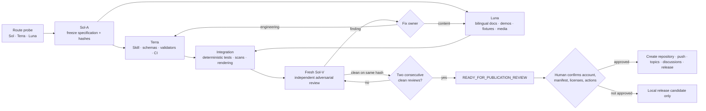
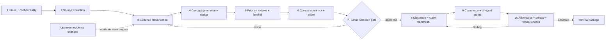

# Evidence-First Patent Skill

**Draft from evidence, not imagination / 从证据出发，不把目标写成结果**


This repository helps engineering teams prepare bilingual China (CN) invention and utility-model disclosure packages from supplied evidence and public prior art. It separates documented facts, measured observations, inferences, and designed proposals; maps claim limitations back to evidence; and keeps a human patent-professional gate before substantive drafting.

> Synthetic demonstration — not a real client matter, not known to be novel, and not filing-ready.
>
> 虚构演示——并非真实客户案件，未确认具备新颖性，也不可直接用于申请。

It is drafting and evidence-governance assistance, not legal advice. It does not guarantee patentability, validity, non-infringement, freedom to operate, ownership, or grant. Obtain qualified counsel review before disclosure, filing, or reliance.

## Five-minute local run

From a clean checkout, initialize the smallest synthetic case and run the dependency-free local checks. These commands use only the Python standard library and make no network request:

```sh
cd evidence-first-patent-skill
python3 skill/draft-patents-evidence-first/scripts/init_case.py ./demo-case --case-id demo-case --language bilingual --patent-type invention
python3 skill/draft-patents-evidence-first/scripts/validate_case.py ./demo-case
python3 skill/draft-patents-evidence-first/scripts/scan_sensitive.py ./demo-case --format json
```

The initialized case is intentionally `BLOCKED` until evidence and the human gate are recorded; structural validation still exits successfully. Contributor tests and optional DOCX/PDF rendering use the dependencies in `requirements-dev.txt` and are exercised by CI. The command interfaces are specified in [the acceptance contract](.workflow/ACCEPTANCE.md#2-required-command-interfaces). The workflow remains local-only by default and never files, publishes, uploads, or pushes.

## The loops

The development loop keeps acceptance independent from implementation. Sol, Terra, Luna, and Sol-V are internal automation roles, not third-party certification. A changed candidate returns to the relevant worker and resets the clean-review count; only two clean Sol-V reviews on the same content hash can reach publication review.



Each patent case follows a separate evidence loop. Any upstream change invalidates affected downstream records instead of silently preserving stale claims.



## How to tell that a draft is not making things up

Look for four checks: every material statement has an evidence record; every claim limitation has a resolvable trace; targets and proposals use future or verification language rather than achieved-result language; and `unsupported_measured_claims` is zero. Conflicts remain visible and block acceptance. Read [the audit example](docs/content/bad-draft-audit-correction.md), [the data interface](skill/draft-patents-evidence-first/references/data-contract.md), and [the provenance diagram](public-assets/evidence-provenance.svg).

## Open-licensed engineering photographs

These photographs illustrate source documentation and mechanical-fixture contexts only. They are not apparatus from the synthetic demos and do not evidence any claimed result.

| Measurement tool | Mechanical fixture |
|---|---|
|  |  |
| Stephanie cheks, CC BY-SA 4.0 | Dmitry Makeev, CC BY-SA 4.0 |

See the [media and license ledger](public-assets/media-ledger.md) for source pages, license links, modifications, and hashes.

## Contents

- [Method and workflow](skill/draft-patents-evidence-first/references/workflow.md)
- [Data interfaces and metrics](skill/draft-patents-evidence-first/references/data-contract.md)
- [Bilingual review](skill/draft-patents-evidence-first/references/bilingual-review.md)
- [Terminology](docs/content/terminology.md)
- [Synthetic invention and utility-model demos](examples/README.md)
- [Public mechanical record](examples/public-mechanical-case.md)
- [Media and license ledger](public-assets/media-ledger.md)
- [Chinese README](README.zh-CN.md)
- [Release notes](RELEASE_NOTES.md) / [中文发布说明](RELEASE_NOTES.zh-CN.md)

All examples and fixtures are synthetic unless explicitly marked as a public record. This repository does not determine inventorship, novelty, legal status, or filing strategy.

## Confidentiality and network boundary

The five-minute checks are fully offline, and case files remain local by default. Prior-art research may use the network only after a human approves a sanitized query that excludes confidential identifiers and unpublished parameter combinations. Do not provide unauthorized client, personal, or third-party restricted material. Local processing does not itself create attorney-client privilege. See the [confidentiality policy](CONFIDENTIALITY.md).

## Licensing

- Code, schemas, CI/configuration files, test harnesses, and automation: [Apache License 2.0](LICENSE).
- Original documentation, narrative examples/fixtures, diagrams, and repository-generated media: [CC BY 4.0](LICENSE-DOCS).
- Third-party photographs: CC BY-SA 4.0 under their upstream terms; see the [media ledger](public-assets/media-ledger.md).

The top-level `LICENSE` identifies the software license; it does not relicense documentation or third-party media. See [NOTICE](NOTICE) for the file-type scope.
