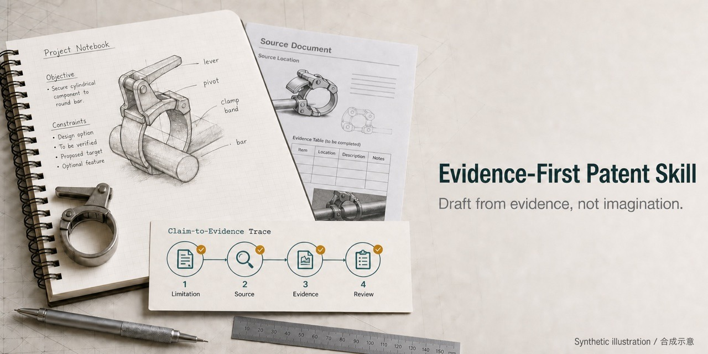
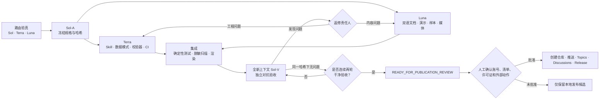
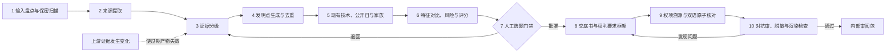
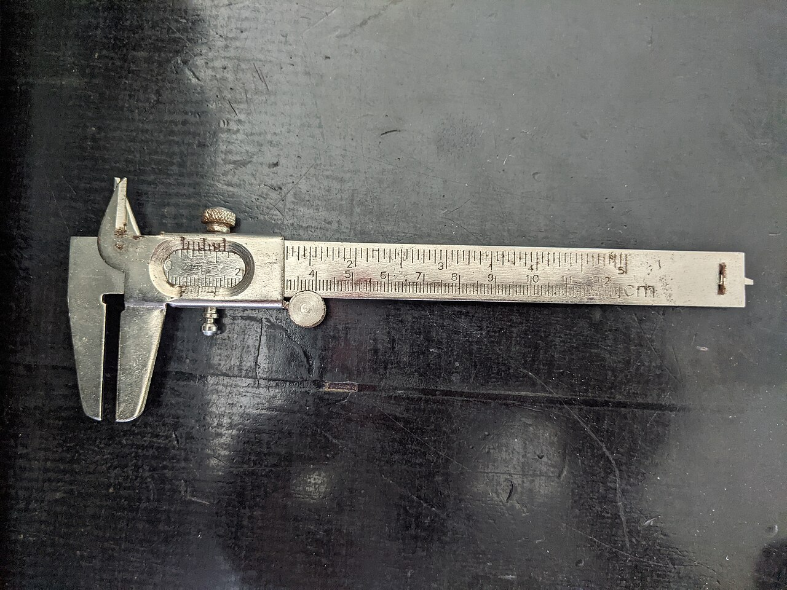
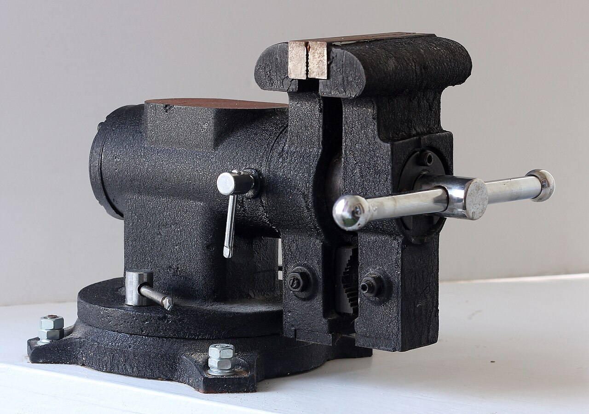

# 证据优先专利 Skill

**Draft from evidence, not imagination / 从证据出发，不把目标写成结果**



本仓库帮助工程团队和专利专业人员，基于用户提供的证据与公开现有技术，准备中国（CN）发明和实用新型的中英双语披露包。它区分已记录事实、实测观察、推断和拟议设计，把每个权利要求限定映射回证据，并在实质性撰写前保留人工专利专业审核门。

> Synthetic demonstration — not a real client matter, not known to be novel, and not filing-ready.
>
> 虚构演示——并非真实客户案件，未确认具备新颖性，也不可直接用于申请。

本工具提供撰写和证据治理辅助，不是法律意见；不保证可专利性、有效性、不侵权、自由实施、权属或授权。披露、申请或依赖前，应由具备相应法域资质的专利专业人员审核。

## 五分钟本地运行

在干净检出目录中初始化最小合成案件，并运行零依赖的本地检查。以下命令只使用 Python 标准库，不发起网络请求：

```sh
cd evidence-first-patent-skill
python3 skill/draft-patents-evidence-first/scripts/init_case.py ./demo-case --case-id demo-case --language bilingual --patent-type invention
python3 skill/draft-patents-evidence-first/scripts/validate_case.py ./demo-case
python3 skill/draft-patents-evidence-first/scripts/scan_sensitive.py ./demo-case --format json
```

初始化后的案件会保持 `BLOCKED`，直到补齐证据和人工门禁；其目录结构仍应成功通过校验。贡献者测试和可选 DOCX/PDF 渲染使用 `requirements-dev.txt` 中的依赖，并由 CI 执行。命令接口见[验收契约](.workflow/ACCEPTANCE.md#2-required-command-interfaces)。默认保持 `local_only`，不提交、发布、上传或推送。

## 两个闭环

开发闭环把实现与验收分开。Sol、Terra、Luna 和 Sol-V 是内部自动化职责，并非第三方认证。候选内容一旦变更，就退回对应执行位并重新累计“干净验收”次数；只有同一内容哈希连续两轮通过 Sol-V，才进入公开发布审阅状态。



每个专利案件另有一条证据闭环。上游材料变化时，受影响的下游记录必须失效，不得悄悄沿用过期权利要求。



## 怎样确认没有把目标编造成结果

检查四点：每条实质性陈述都有证据记录；每个权利要求限定都有可解析溯源；目标和方案使用“拟”“待验证”等措辞，不写成已实现结果；`unsupported_measured_claims` 为零。冲突必须保留并阻断验收。请看[错误稿→证据审计→修正稿](docs/content/bad-draft-audit-correction.md)、[数据接口](skill/draft-patents-evidence-first/references/data-contract.md)和[溯源图](public-assets/evidence-provenance.svg)。

## 开放许可工程实景照片

下列照片只用于说明工程资料与机械夹持场景，不属于合成演示装置，也不能证明任何权利要求效果。

| 测量工具 | 机械夹具 |
|---|---|
|  |  |
| Stephanie cheks，CC BY-SA 4.0 | Dmitry Makeev，CC BY-SA 4.0 |

来源页、许可链接、修改说明和文件哈希见[媒体与许可台账](public-assets/media-ledger.md)。

## 内容导航

- [方法与工作流](skill/draft-patents-evidence-first/references/workflow.md)
- [数据接口与指标](skill/draft-patents-evidence-first/references/data-contract.md)
- [双语审核](skill/draft-patents-evidence-first/references/bilingual-review.md)
- [双语术语表](docs/content/terminology.md)
- [发明与实用新型合成演示](examples/README.md)
- [公开机械专利记录](examples/public-mechanical-case.md)
- [媒体与许可台账](public-assets/media-ledger.md)
- [English README](README.md)
- [发布说明](RELEASE_NOTES.zh-CN.md) / [English release notes](RELEASE_NOTES.md)

除明确标注为公开记录者外，示例和 fixture 均为合成内容。本仓库不判断发明人、新颖性、法律状态或申请策略。

## 保密与联网边界

五分钟检查完全离线，案件文件默认仅在本地处理。现有技术检索只有在人工确认脱敏查询后才可联网；查询必须移除保密标识和未公开参数组合。不得提供未经授权的客户材料、个人信息或第三方受限资料。本地处理本身不会自动形成律师—客户保密特权。详见[保密政策](CONFIDENTIALITY.md)。

## 许可证

- 代码、数据模式、持续集成/配置文件、测试程序和自动化：[Apache License 2.0](LICENSE)。
- 原创文档、叙事性示例/样本、图示和仓库生成媒体：[CC BY 4.0](LICENSE-DOCS)。
- 第三方照片：依上游 CC BY-SA 4.0 条款使用，详见[媒体台账](public-assets/media-ledger.md)。

根目录 `LICENSE` 表示软件许可证，并不重新许可文档或第三方媒体；文件类型范围见 [NOTICE](NOTICE)。
